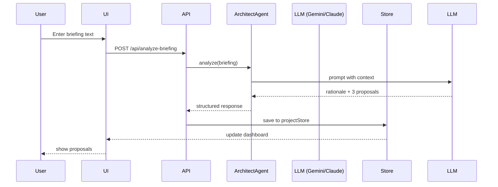
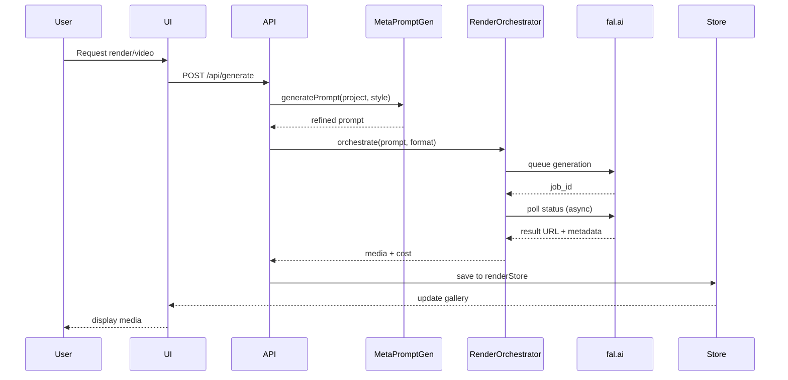
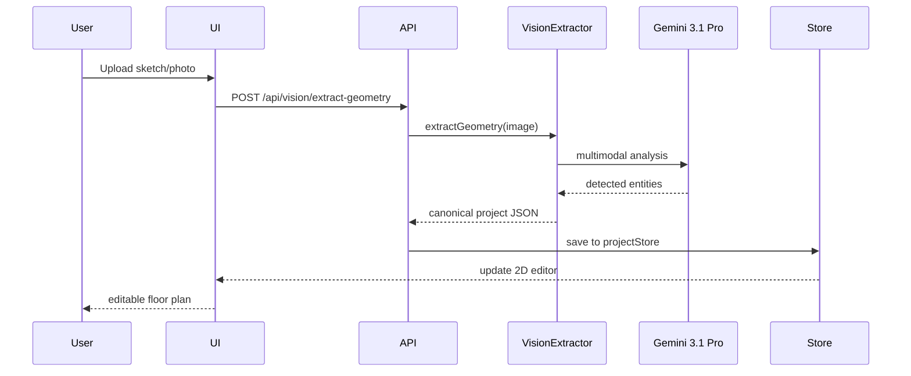
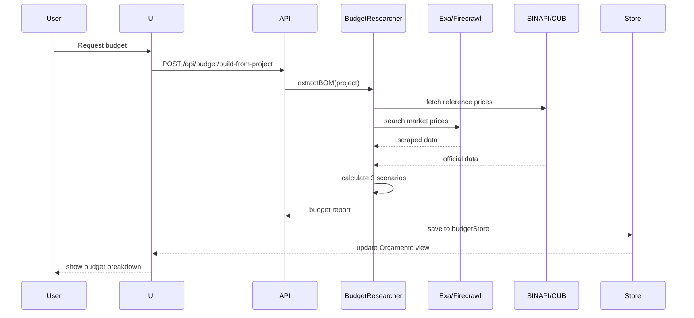

# SYSTEM_MAP.md — EGOS ARCH

> **VERSION:** 1.0.0 | **CREATED:** 2026-03-31
> **PURPOSE:** Visual and conceptual map of the Arch system architecture
> **SCOPE:** Data flows, component relationships, deployment topology

---

## 🗺️ High-Level Architecture

```
┌─────────────────────────────────────────────────────────────────┐
│                         USER INTERFACE                          │
│                    (React 19 + Tailwind 4)                      │
├─────────────────────────────────────────────────────────────────┤
│  Dashboard Views:                                               │
│  • Briefing          • Renders        • Telemetria EGOS         │
│  • Croqui & Terreno  • Vídeo          • Exportações             │
│  • Workflow          • Planta 2D      • Orçamento (NEW)         │
│  • Massa 3D          • Pipeline                                 │
└──────────────────┬──────────────────────────────────────────────┘
                   │
                   ▼
┌─────────────────────────────────────────────────────────────────┐
│                      STATE MANAGEMENT                           │
│                        (Zustand v4)                             │
├─────────────────────────────────────────────────────────────────┤
│  Stores:                                                        │
│  • projectStore      • telemetryStore                           │
│  • briefingStore     • budgetStore (NEW)                        │
│  • renderStore       • metaPromptStore                          │
└──────────────────┬──────────────────────────────────────────────┘
                   │
                   ▼
┌─────────────────────────────────────────────────────────────────┐
│                      API LAYER (Express)                        │
│                         server.ts                               │
├─────────────────────────────────────────────────────────────────┤
│  Endpoints:                                                     │
│  • /api/chat                  • /api/cost-estimate/:tier        │
│  • /api/analyze-briefing      • /api/generate                   │
│  • /api/models                • /api/vision/extract-geometry    │
│  • /api/copilot/suggest       • /api/meta-prompts/*             │
│  • /api/budget/* (NEW)                                          │
└──────────────────┬──────────────────────────────────────────────┘
                   │
        ┌──────────┴──────────┬──────────────┬──────────────┐
        ▼                     ▼              ▼              ▼
┌───────────────┐   ┌──────────────┐  ┌─────────────┐  ┌─────────────┐
│ AI PROVIDERS  │   │   RENDER     │  │   SEARCH    │  │    DATA     │
│               │   │   ENGINES    │  │   ENGINES   │  │   SOURCES   │
├───────────────┤   ├──────────────┤  ├─────────────┤  ├─────────────┤
│ • Gemini 3.1  │   │ • fal.ai     │  │ • Exa       │  │ • SINAPI    │
│ • Claude 4.6  │   │   - Flux     │  │ • Firecrawl │  │ • CUB       │
│ • GPT-5.4     │   │   - Recraft  │  │ • Perplexity│  │ • ORSE      │
│               │   │   - Luma     │  │ • Brave     │  │ • SICRO     │
│               │   │   - Veo 3.1  │  │             │  │ • Retail    │
└───────────────┘   └──────────────┘  └─────────────┘  └─────────────┘
```

---

## 🔄 Core Data Flows

### Flow 1: User Briefing → Design Proposals



### Flow 2: Project → Render/Video (Current)



### Flow 3: Sketch Upload → Canonical JSON (Planned)



### Flow 4: Project → Budget Estimate (Planned)



---

## 🧩 Component Architecture

### Frontend (React 19)

```
src/
├── components/
│   ├── layout/
│   │   ├── Header.tsx
│   │   ├── Sidebar.tsx
│   │   └── Footer.tsx
│   ├── briefing/
│   │   ├── BriefingForm.tsx
│   │   ├── ProposalCard.tsx
│   │   └── RationaleDisplay.tsx
│   ├── media/
│   │   ├── RenderGallery.tsx
│   │   ├── VideoPlayer.tsx
│   │   └── PromptEditor.tsx
│   ├── budget/ (NEW — Planned)
│   │   ├── BudgetSummary.tsx
│   │   ├── ItemBreakdown.tsx
│   │   ├── ScenarioToggle.tsx
│   │   └── SourceTraceability.tsx
│   ├── telemetry/
│   │   ├── CostDashboard.tsx
│   │   ├── EventLog.tsx
│   │   └── MetricsChart.tsx
│   └── shared/
│       ├── Button.tsx
│       ├── Card.tsx
│       ├── LoadingSpinner.tsx
│       └── Modal.tsx
├── store/
│   ├── projectStore.ts
│   ├── briefingStore.ts
│   ├── renderStore.ts
│   ├── telemetryStore.ts
│   ├── budgetStore.ts (NEW)
│   └── metaPromptStore.ts
├── schemas/
│   ├── project.ts
│   ├── briefing.ts
│   ├── budget.ts (NEW)
│   └── telemetry.ts
└── lib/
    ├── api.ts              # API client
    ├── router.ts           # Multi-provider router
    └── utils.ts
```

### Backend (Express + TypeScript)

```
server.ts (unified server)
├── Routes:
│   ├── /api/chat
│   ├── /api/analyze-briefing
│   ├── /api/models
│   ├── /api/cost-estimate/:tier
│   ├── /api/generate
│   ├── /api/copilot/suggest
│   ├── /api/vision/extract-geometry (currently mockado)
│   ├── /api/meta-prompts/*
│   └── /api/budget/* (NEW — Planned)
│       ├── /build-from-project
│       ├── /research-prices
│       ├── /recalculate
│       ├── /:projectId/latest
│       ├── /:projectId/versions
│       ├── /:projectId/lock
│       └── /:projectId/report
├── Middleware:
│   ├── CORS
│   ├── Body parser
│   ├── Rate limiting (planned)
│   └── Auth (planned)
└── Integrations:
    ├── Vite dev server (development)
    ├── Static file serving (production)
    └── Telemetry emitter
```

### AI Layer

```
src/ai/
├── agents/
│   ├── architect.ts              # Briefing interpreter
│   ├── budget-researcher.ts      # Price discovery (planned)
│   ├── vision-extractor.ts       # Sketch → JSON (planned)
│   └── copilot.ts                # Real-time suggestions (planned)
├── prompts/
│   ├── architect-agent.ts
│   ├── meta-prompt-templates/
│   └── budget-analyst.ts (planned)
├── orchestrator/
│   ├── pipeline.ts               # Render/video orchestration
│   └── budget-pipeline.ts (planned)
└── providers/
    ├── gemini.ts
    ├── claude.ts
    ├── openai.ts
    └── router.ts                 # Multi-provider routing
```

---

## 🌐 Deployment Topology

```
┌─────────────────────────────────────────────────────────┐
│                    INTERNET                             │
└──────────────────┬──────────────────────────────────────┘
                   │
                   ▼
┌─────────────────────────────────────────────────────────┐
│              CADDY (Reverse Proxy)                      │
│              arch.egos.ia.br → :3098                    │
└──────────────────┬──────────────────────────────────────┘
                   │
                   ▼
┌─────────────────────────────────────────────────────────┐
│          HETZNER VPS (Docker Container)                 │
│                                                         │
│  ┌───────────────────────────────────────────────┐     │
│  │   Docker Container: enioxt/arch:latest        │     │
│  │                                               │     │
│  │   ┌─────────────────────────────────────┐     │     │
│  │   │  Node.js Express Server             │     │     │
│  │   │  Port: 3098                         │     │     │
│  │   │                                     │     │     │
│  │   │  • API routes                       │     │     │
│  │   │  • Static files (Vite build)        │     │     │
│  │   │  • Telemetry emitter                │     │     │
│  │   └─────────────────────────────────────┘     │     │
│  │                                               │     │
│  │   ENV:                                        │     │
│  │   • GEMINI_API_KEY                            │     │
│  │   • ANTHROPIC_API_KEY                         │     │
│  │   • OPENAI_API_KEY                            │     │
│  │   • FAL_KEY                                   │     │
│  │   • EXA_API_KEY (planned)                     │     │
│  │   • FIRECRAWL_API_KEY (planned)               │     │
│  │   • PERPLEXITY_API_KEY (planned)              │     │
│  └───────────────────────────────────────────────┘     │
│                                                         │
└─────────────────────────────────────────────────────────┘
```

### External Service Dependencies

```
ARCH Server
    ├─→ Gemini API (ai.google.dev)
    ├─→ Anthropic API (api.anthropic.com)
    ├─→ OpenAI API (api.openai.com)
    ├─→ fal.ai (fal.run)
    ├─→ Exa (api.exa.ai) [planned]
    ├─→ Firecrawl (api.firecrawl.dev) [planned]
    ├─→ Perplexity (api.perplexity.ai) [planned]
    ├─→ SINAPI (caixa.gov.br) [planned]
    ├─→ CUB Sinduscon-MG (sinduscon-mg.org.br) [planned]
    ├─→ ORSE (orse.mg.gov.br) [planned]
    └─→ DNIT SICRO (servicos.dnit.gov.br) [planned]
```

---

## 📦 Data Models

### Project Schema

```typescript
type Project = {
  id: string;
  version: string;
  createdAt: string;
  updatedAt: string;
  owner: string;

  // Briefing
  briefing: {
    text: string;
    style: string[];
    budget: number;
    terrain: {
      dimensions: { width: number; depth: number };
      orientation: string;
      topography: string;
      address?: string;
    };
    requirements: string[];
  };

  // Design
  rationale: string;
  proposals: DesignProposal[];
  chosenProposal?: string;

  // Geometry (planned)
  floorPlan?: FloorPlan;
  geometry3D?: Geometry3D;

  // Media
  renders: Render[];
  videos: Video[];

  // Budget (planned)
  budget?: BudgetReport;

  // Metadata
  status: "draft" | "in_progress" | "completed";
  telemetry: TelemetrySnapshot;
};
```

### Budget Schema (Planned)

```typescript
type BudgetReport = {
  projectId: string;
  version: string;
  region: string;
  generatedAt: string;

  scenarios: BudgetScenario[];
  items: BudgetItem[];

  methodology: string[];
  alerts: string[];

  totalCost: {
    low: number;
    mid: number;
    high: number;
  };
};

type BudgetScenario = {
  scenario: "economico" | "padrao" | "premium";
  subtotalMaterials: number;
  subtotalLabor: number;
  subtotalEquipment: number;
  subtotalLogistics: number;
  contingency: number;
  bdi: number;
  taxes: number;
  total: number;
};

type BudgetItem = {
  id: string;
  category: string;
  name: string;
  description?: string;
  quantity: number;
  unit: string;
  wasteFactor: number;
  regionalFactor: number;
  complexityFactor: number;
  sources: CostSource[];
  prices: PricePoint[];
  totalLow: number;
  totalMid: number;
  totalHigh: number;
  confidenceScore: number;
  assumptions: string[];
};
```

---

## 🔐 Security Layers

### Authentication (Planned)
- JWT-based auth
- OAuth providers (Google, GitHub)
- Session management with Redis

### Authorization (Planned)
- Role-based access control (RBAC)
- Project-level permissions
- API key quotas

### Data Protection
- All API keys in environment variables
- Secrets never committed to git
- HTTPS enforced via Caddy
- CORS configured

---

## 📈 Observability Stack

### Telemetry Events
```typescript
type TelemetryEvent = {
  timestamp: string;
  event_type: string;
  agent: string;
  project_id?: string;
  user_id?: string;
  session_id: string;
  latency_ms: number;
  tokens_in?: number;
  tokens_out?: number;
  cost_usd: number;
  provider: string;
  confidence_score?: number;
  error?: string;
  metadata: Record<string, any>;
};
```

### Metrics Tracked
- Request/response times
- API costs per request
- Error rates
- User actions
- Feature usage

### Planned Integrations
- Prometheus (metrics)
- Grafana (dashboards)
- Sentry (error tracking)
- LogTail (log aggregation)

---

## 🔄 State Synchronization

### Client ↔ Server
- Optimistic updates on client
- Server as source of truth
- Conflict resolution via version timestamps

### Multi-tab Sync (Planned)
- BroadcastChannel API
- SharedWorker for coordination

---

## 🚀 Scaling Strategy

### Current (MVP)
- Single Docker container
- In-memory state
- File-based persistence (planned)

### Phase 2 (Production-ready)
- PostgreSQL for structured data
- Redis for caching
- S3 for media storage
- Load balancer

### Phase 3 (Scale)
- Kubernetes cluster
- Horizontal pod autoscaling
- CDN for media delivery
- Managed databases

---

## 📚 Related Documents

- `AGENTS.md` — Agent registry
- `CAPABILITY_REGISTRY.md` — Detailed capability specs
- `TASKS.md` — Implementation roadmap
- `docs/ARCH_PRODUCT_ARCHITECTURE.md` — Product vision
- `.guarani/PREFERENCES.md` — Coding standards
- `/home/enio/Downloads/compiladochats/egos_arch_modulo_orcamento_v1.md` — Budget module spec

---

**Maintained by:** Enio Rocha
**Last updated:** 2026-03-31
**Next review:** 2026-04-07
